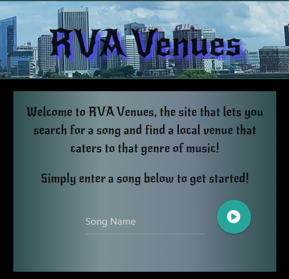
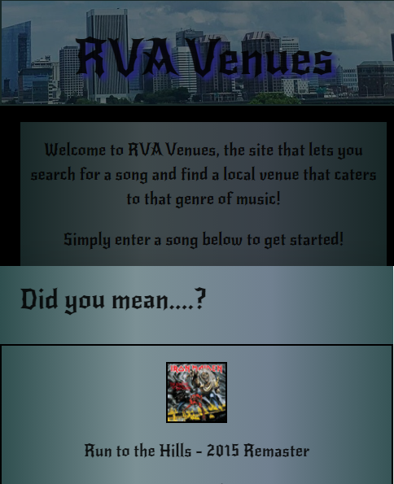
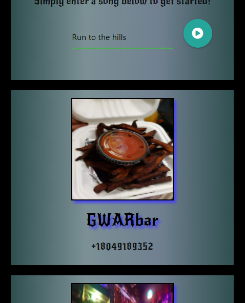
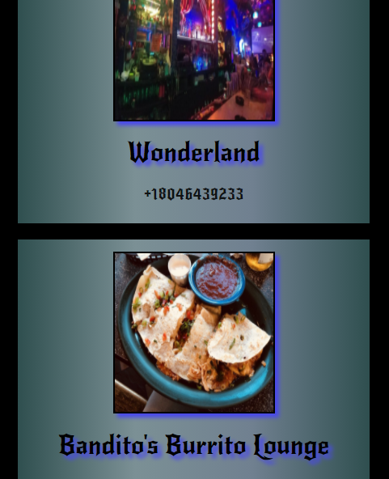

# RVAVenues

RVAVenues is an app created by Alex Syrovatka, Drew McGhie, Jordan Sarvay, and Maryangelia Gordon.

The purpose of this app is to allow the user to search for a song, and get a recommendation for a local venue in Richmond, Virginia that caters to that type of music.
The search will bring up a modal which will feature recommendations from the Spotify Api for users to use in their query.
We than run that query through an array of venues we have to find a close match. This match is created by a formula which will put the last five shows at a venue into spotify and average those into a quantifiable number that we can use to compare to the searched song's values.
We than use the Yelp API to organize our list of venues from best match to worst.

With this app, users can...

-input a song into the search bar.

-choose from close matches in the modal to perform a search for a venue.

-read through the list of venues.

-click on the venue to be taken to their personal yelp page to get more information.

-See their recent searches displayed beneath the search bar.

Any questions or concerns with the app can be directed to Jordan Sarvay by email at jordans1@vt.edu or by phone at 804-305-4878.

Deployed URL: https://nickelme.github.io/RVAVenues/

Future Devlopment:
Going forward with this app, we would like to continue expanding our array of venues to include even more in the Richmond Area.
As well, we would like to make it even more accurate by feeding more data into our formula using more previous shows as well as upcoming ones, to create an even more accurate rating for each.